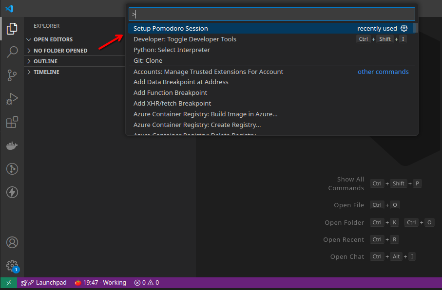
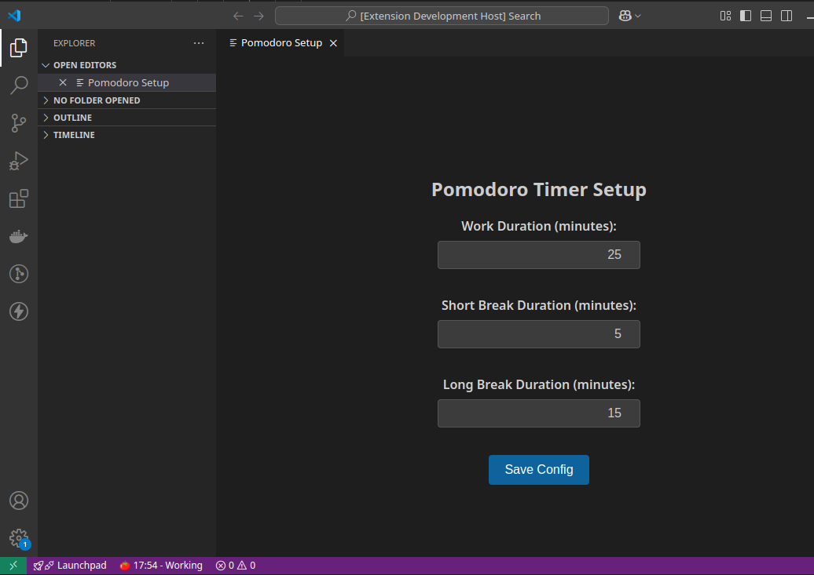
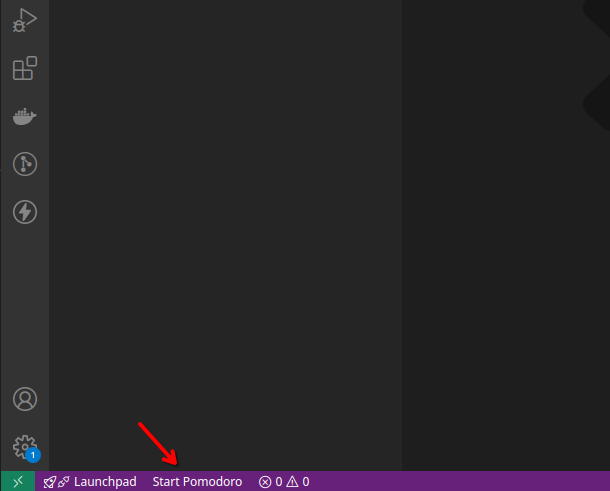
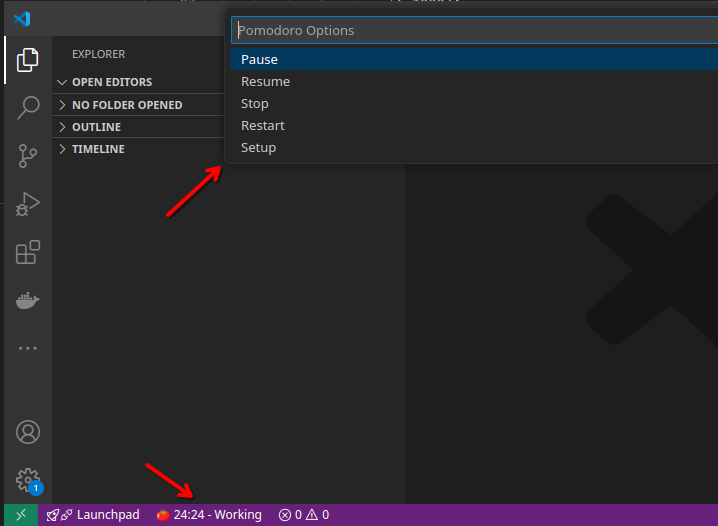

# Pomodoro Session for VS Code

A focused, session-based Pomodoro extension for developers. First **configure**, then **start your session**, and finally **manage it with simple controls**.

<p>&nbsp;</p>

## Features

- 📋 **Session-first workflow**: Configure durations before starting.
- ⏱️ **Status bar integration** with live timer and controls.
- 🔔 **Blocking notifications** at phase transitions (dismissible alerts).
- 💾 **Persistent configuration** between sessions.

<p>&nbsp;</p>

## Setup Your Session

Use the **Command Palette** (`Ctrl+Shift+P`) and choose:





<p>&nbsp;</p>


## ▶️ Start Your Session

Once setup is saved, run:



The timer begins in the status bar.

<p>&nbsp;</p>

## Manage Options In-Session

Click the status bar timer to access:

- ⏸ Pause
- ▶️ Resume
- 🔄 Restart current timer
- 🛑 Stop (requires confirmation)



<p>&nbsp;</p>

## Persistent Config

Pomodoro Session stores configuration in your **VS Code workspace settings**. These are automatically saved when you use the **Setup Session** panel.

### Settings Keys

```json
{
  "pomodoroSession.workDuration": 25,
  "pomodoroSession.shortBreakDuration": 5,
  "pomodoroSession.longBreakDuration": 15
}
```

### Description

| Setting                              | Type   | Default | Description                         |
|--------------------------------------|--------|---------|-------------------------------------|
| `pomodoroSession.workDuration`       | number | `25`    | Duration in minutes for work phase  |
| `pomodoroSession.shortBreakDuration` | number | `5`     | Duration in minutes for short break |
| `pomodoroSession.longBreakDuration`  | number | `15`    | Duration in minutes for long break  |


<p>&nbsp;</p>

## Tests

Unit tests ensure correct transitions through work, break, and long break phases.

